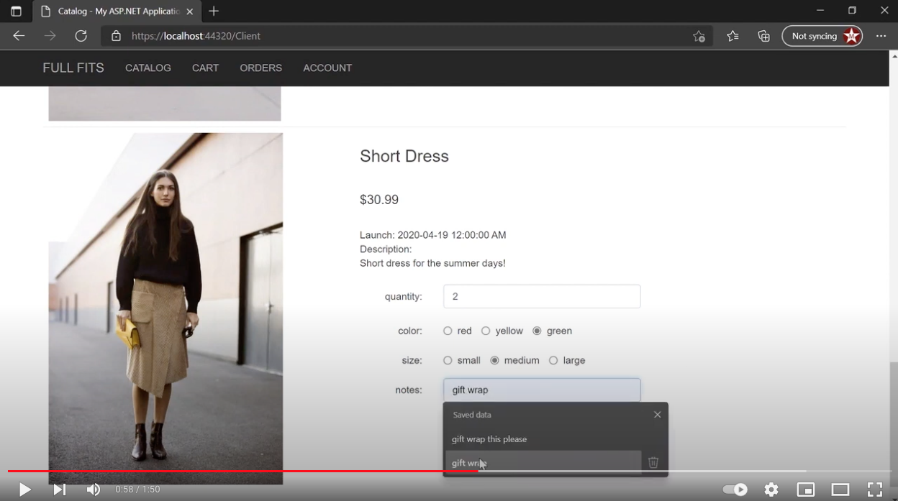

# Full_Fits_2.0_ASP.NET
Ecommerce website driven by Visual Studio's ASP.NET. Localhost backend with SQL and client side written with C#. This project was created for a course at my 2nd year of Humber College.

## Features
* SQL Database with mysql
* responsive UI and nav drawer
* list item pictures, desc, and dates
* add item to cart with many options
* update cart by specific item
* checkout page
* sign in and register users
* login with Google Account
* all orders and recipets page
* edit account information
* logout 

## Demo

